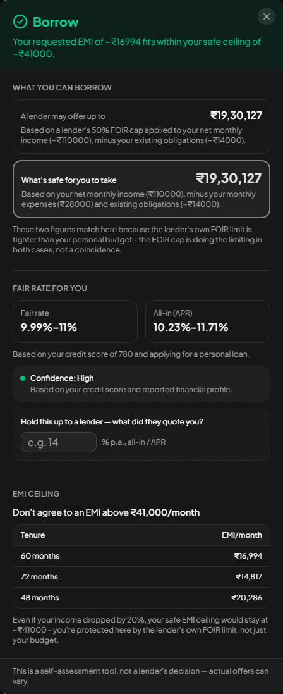
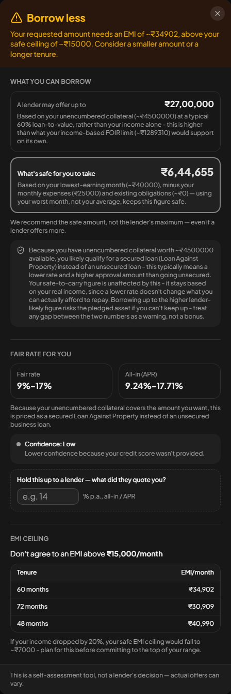
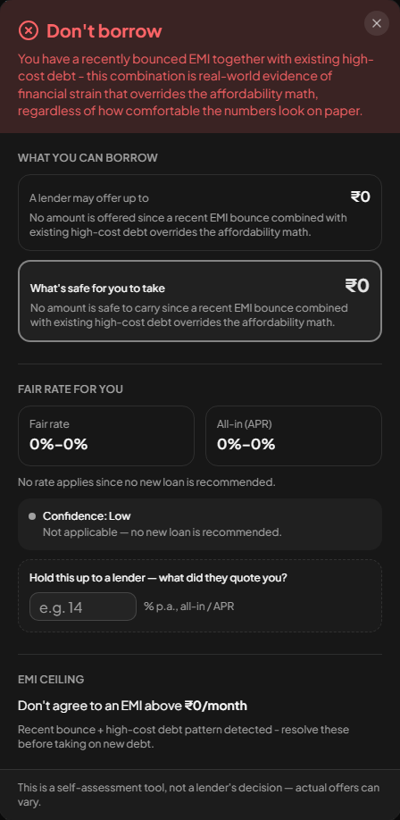

# Three run-throughs
---

## Priya — 29, Bengaluru, salaried, personal loan for a wedding

Software engineer at a large MNC for 5 years. Net ₹1,10,000/month. One car
loan, EMI ₹14,000, 2 years left. Credit score 780. Rents at ₹28,000. Wants
₹8,00,000.

### Inputs given

| Field | Value |
|---|---|
| Loan type | Personal |
| Amount wanted | ₹8,00,000 |
| Income type | Salaried |
| Tenure preferred | 60 months |
| Age | 29 |
| Net monthly income | ₹1,10,000 |
| Existing EMIs | 1 — Personal, ₹14,000/month, 9.5% p.a. |
| Monthly expenses | ₹28,000 |
| Had EMI bounces | No |
| Has high-cost debt | No |
| Credit score | 780 |
| Has collateral | No |

### Questions this persona was asked

Loan type · Amount wanted · Tenure preferred (months) · Age · Income type ·
Net monthly income · Do you own any property/asset you could pledge as
collateral? (Yes/No) · Existing EMIs (EMI type, Amount/month, Interest
rate) · Your monthly expenses · Any EMI bounces? (Yes/No) · Any existing
high-cost/informal debt? (Yes/No) · Credit score · I don't know my credit
score

Notably absent: the self-employed/informal income-range fields, and the
collateral-value/pledged follow-ups — none of those apply to a salaried
applicant with no collateral, and the form never asked.

### Outputs

**O1 — Borrow**
> Your requested EMI of ~₹16994 fits within your safe ceiling of ~₹41000.

**O2 — Maximum amount**
- Lender likely to offer: **₹19,30,127** — Based on a lender's 50% FOIR cap applied to your net monthly income (~₹110000), minus your existing obligations (~₹14000).
- Safe to carry: **₹19,30,127** — Based on your net monthly income (₹110000), minus your monthly expenses (₹28000) and existing obligations (~₹14000).
- *These two figures match here because the lender's own FOIR limit is tighter than your personal budget - the FOIR cap is doing the limiting in both cases, not a coincidence.*

**O3 — Fair rate**
- Rate band: 9.99% – 11%
- All-in APR: 10.23% – 11.71%
- Confidence: **High** — Based on your credit score and reported financial profile.
- Based on your credit score of 780 and applying for a personal loan.

**O4 — EMI ceiling**
- Don't exceed: **₹41,000/month**
- Tenure options:

  | Tenure | EMI/month |
  |---|---|
  | 60 months | ₹16,994 |
  | 72 months | ₹14,817 |
  | 48 months | ₹20,286 |

- Stress case: Even if your income dropped by 20%, your safe EMI ceiling would stay at ~₹41000 - you're protected here by the lender's own FOIR limit, not just your budget.

### Negotiation Card

---

## Ravi — 42, Mysuru, self-employed, business loan for stock + a delivery vehicle

Kirana store for 14 years. Cash income ₹40,000–80,000/month; ITR shows
₹4,20,000/year. Owns the shop premises, ~₹45,00,000, unencumbered. Never
taken a formal loan; no credit score. Wife earns ₹18,000 teaching. Wants
₹15,00,000.

### Inputs given

| Field | Value |
|---|---|
| Loan type | Business |
| Amount wanted | ₹15,00,000 |
| Income type | Self-employed |
| Tenure preferred | 60 months |
| Age | 42 |
| Income range | ₹40,000 – ₹80,000/month |
| Years in business | 14 |
| Existing EMIs | None |
| Monthly expenses | ₹25,000 |
| Had EMI bounces | No |
| Has high-cost debt | No |
| Credit score | Unknown |
| Has collateral | Yes — ₹45,00,000, not already pledged |

### Questions this persona was asked

Loan type · Amount wanted · Tenure preferred (months) · Age · Income type ·
Income stability (monthly): Low income month, High income month · Years in
business · Do you own any property/asset you could pledge as collateral?
(Yes/No) · Estimated value of that asset · Is it already pledged against
any existing loan? (Yes/No) · Existing EMIs · Your monthly expenses · Any
EMI bounces? (Yes/No) · Any existing high-cost/informal debt? (Yes/No) ·
Credit score · I don't know my credit score

Unlike Priya, Ravi saw the self-employed income-range fields and the
collateral-value follow-up (since he answered "yes" to owning an asset) —
but not the pledged-loan follow-ups (outstanding amount, rate, remaining
tenure), since he answered "no" to it already being pledged.

### Outputs

**O1 — Borrow less**
> Your requested amount needs an EMI of ~₹34902, above your safe ceiling of ~₹15000. Consider a smaller amount or a longer tenure.

**O2 — Maximum amount**
- Lender likely to offer: **₹27,00,000** — Based on your unencumbered collateral (~₹4500000) at a typical 60% loan-to-value, rather than your income alone - this is higher than what your income-based FOIR limit (~₹1289310) would support on its own.
- Safe to carry: **₹6,44,655** — Based on your lowest-earning month (~₹40000), minus your monthly expenses (₹25000) and existing obligations (~₹0) — using your worst month, not your average, keeps this figure safe.
- Routed to a secured product: **Yes.** Because you have unencumbered collateral worth ~₹4500000 available, you likely qualify for a secured loan (Loan Against Property) instead of an unsecured loan - this typically means a lower rate and a higher approval amount than going unsecured. Your safe-to-carry figure is unaffected by this - it stays based on your real income, since a lower rate doesn't change what you can actually afford to repay. Borrowing up to the higher lender-likely figure risks the pledged asset if you can't keep up - treat any gap between the two numbers as a warning, not a bonus.

**O3 — Fair rate**
- Rate band: 9% – 17%
- All-in APR: 9.24% – 17.71%
- Confidence: **Low** — Lower confidence because your credit score wasn't provided.
- Because your unencumbered collateral covers the amount you want, this is priced as a secured Loan Against Property instead of an unsecured business loan.

**O4 — EMI ceiling**
- Don't exceed: **₹15,000/month**
- Tenure options:

  | Tenure | EMI/month |
  |---|---|
  | 60 months | ₹34,902 |
  | 72 months | ₹30,909 |
  | 48 months | ₹40,990 |

- Stress case: If your income dropped by 20%, your safe EMI ceiling would fall to ~₹7000 - plan for this before committing to the top of your range.

### Negotiation Card

---

## Anita — 35, Hubballi, informal, two-wheeler loan for an EV scooter

Delivery-platform rider plus home tailoring. ₹26,000–30,000/month, two
children, husband unemployed 8 months. Three app loans, ₹35,000
outstanding at 30%+, one EMI bounced last month. Wants ₹1,50,000.

### Inputs given

| Field | Value |
|---|---|
| Loan type | Two-Wheeler |
| Amount wanted | ₹1,50,000 |
| Income type | Informal |
| Tenure preferred | 24 months |
| Age | 35 |
| Income range | ₹26,000 – ₹30,000/month |
| Years doing this work | 3 |
| Existing EMIs | None |
| Monthly expenses | ₹18,000 |
| Had EMI bounces | Yes — 1 bounce, within the last month |
| Has high-cost debt | Yes — ₹35,000 outstanding at 30% p.a. |
| Credit score | Unknown |
| Has collateral | No |

### Questions this persona was asked

Loan type · Amount wanted · Tenure preferred (months) · Age · Income type ·
Income stability (monthly): Low income month, High income month · How long
have you been doing this work? · Do you own any property/asset you could
pledge as collateral? (Yes/No) · Existing EMIs · Your monthly expenses ·
Any EMI bounces? (Yes/No) · EMI type, EMI amount, How frequent, How recent
· Any existing high-cost/informal debt? (Yes/No) · Total outstanding
amount, Interest rate (% p.a.) · Credit score · I don't know my credit
score

Anita is the only one of the three who saw the EMI-bounce detail fields
(type, amount, frequency, recency) and the high-cost-debt amount/rate
fields — both only appear because she answered "yes" to those two
questions. She saw the informal-work phrasing ("How long have you been
doing this work?") rather than Ravi's "Years in business," even though
both map to the same underlying field.

### Outputs

**O1 — Don't borrow**
> You have a recently bounced EMI together with existing high-cost debt - this combination is real-world evidence of financial strain that overrides the affordability math, regardless of how comfortable the numbers look on paper.

**O2 — Maximum amount**
- Lender likely to offer: **₹0** — No amount is offered since a recent EMI bounce combined with existing high-cost debt overrides the affordability math.
- Safe to carry: **₹0** — No amount is safe to carry since a recent EMI bounce combined with existing high-cost debt overrides the affordability math.

**O3 — Fair rate**
- Rate band: 0% – 0%
- All-in APR: 0% – 0%
- Confidence: **Low** — Not applicable — no new loan is recommended.
- No rate applies since no new loan is recommended.

**O4 — EMI ceiling**
- Don't exceed: **₹0/month**
- Tenure options: none — the override fires before any tenure math runs.
- Stress case: Recent bounce + high-cost debt pattern detected - resolve these before taking on new debt.

### Negotiation Card

---

## Regression check

All three outcomes match what was previously validated in this project:
**Priya → Borrow**, **Ravi → Borrow less, routed to a secured product**,
**Anita → Don't borrow via the bounce + high-cost-debt override**. No
regression to report.
